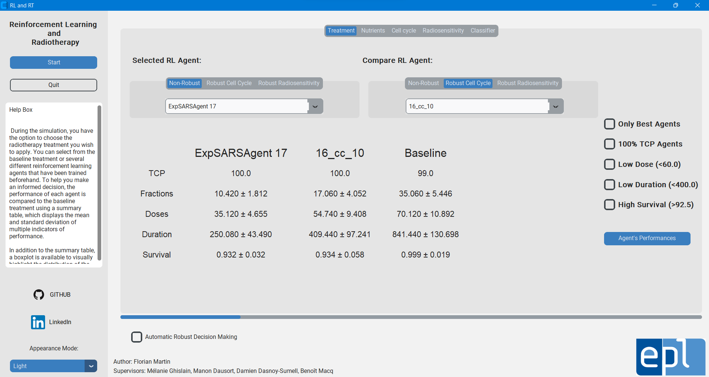
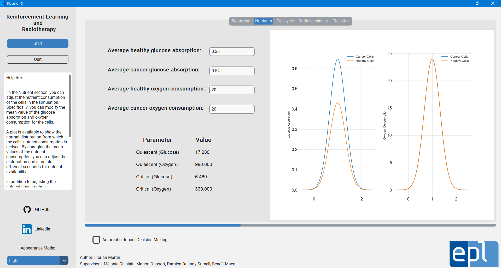
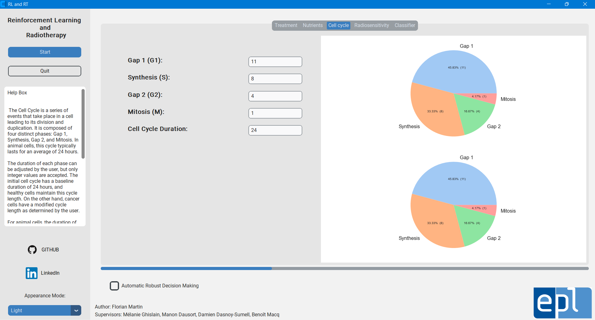
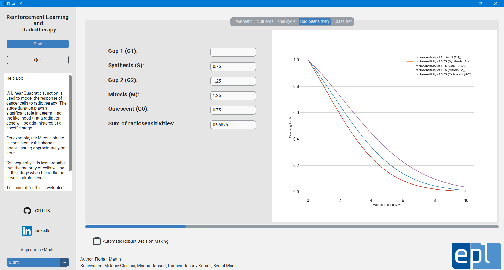
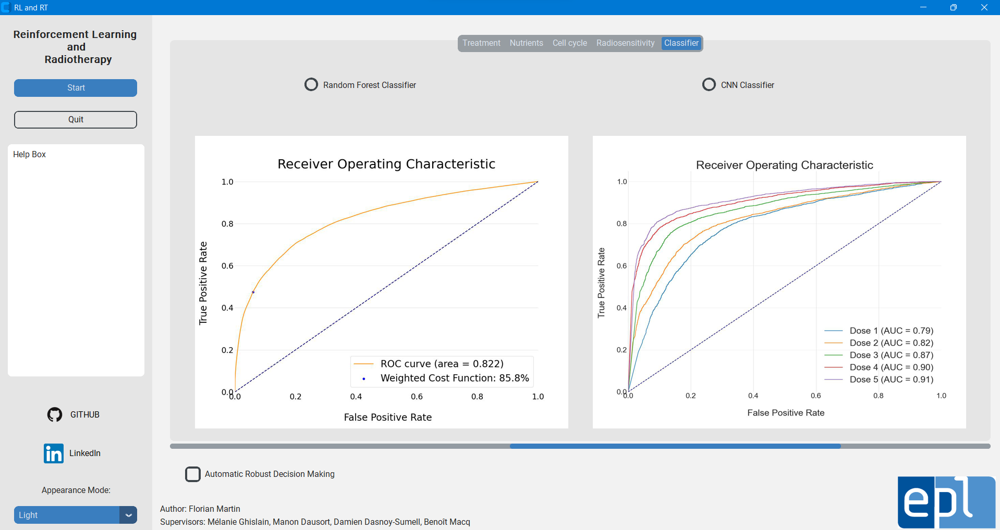
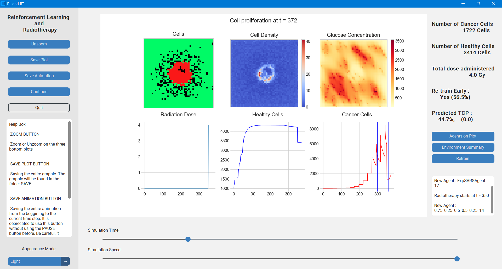

# Reinforcement learning optimization for radiotherapy treatments
Reinforcement Learning Open-Source Project for Radiotherapy Treatments. 


## Key points

- [x] Reinforcement learning (RL) optimization
- [x] Pre-trained RL agents
- [x] Easy simulations
- [ ] Custom radiotherapy treatments 


## Description

We used a cellular model that results from the combination of a cellular model developed by [A. Jalalimanesh](https://www.sciencedirect.com/science/article/abs/pii/S0378475416300878) and another one developed by [O'Neil](https://scholarscompass.vcu.edu/etd/2831/). Reinforcement learning algorithms (Q-learning, Sarsa and Expected Sarsa) are used to provide optimizations on radiotherapy treatments. The goal of this work is to generate superior radiotherapy treatment plans concerning Tumor Control Probability (TCP), number of radiation fractions, total radiation dose, treatment duration, and healthy cell survival rate.

<details>
   <summary>Additional Informations</summary>
   <p>
This open-source project introduces an autonomous decision-making framework designed to evaluate whether adjustments are required in the ongoing radiotherapy treatment. Leveraging advanced machine learning algorithms, it analyzes tumor imaging during the treatment, fostering enhanced precision and effectiveness in radiotherapy procedures.</p>
</details>

## Usage

```anaconda
python application.py
```

<details>
   <summary>Home Page</summary>
   <p><p align="center">

</p></p>
</details>

<details>
   <summary>Nutrients Page</summary>
   <p><p align="center">

</p></p>
</details>

<details>
   <summary>Cell Cycle Page</summary>
   <p><p align="center">

</p></p>
</details>

<details>
   <summary>Radiosensitivity Page</summary>
   <p><p align="center">

</p></p>
</details>

<details>
   <summary>Classifier Page</summary>
   <p><p align="center">

</p></p>
</details>

<details>
   <summary>Simulation Page</summary>
   <p><p align="center">

</p></p>
</details>

## Results

The baseline treatment corresponds to a radiotherapy treatment where a dose of 2 Gy is given every 24 hours to the patient. We compare the performance of our automatic decision-making architecture with the baseline treatment on different types of cellular environments (with modified radiosensitivity or modified cell cycle duration) :

|                | Radiosensitivity of 0.8 | Radiosensitivity of 0.7 | Radiosensitivity of 0.6 | Cell cycle of 24h | Cell cycle of 20h | Cell cycle of 18h | Cell cycle of 16h |
|:--------------:|:-----------------------:|:-----------------------:|:-----------------------:|:-----------------:|:-----------------:|:-----------------:|:-----------------:|
|    Baseline    |         -52.4\%         |         -51.0\%         |         -33.2\%         |      -55.0\%      |      -62.3\%      |      -59.0\%      |      -50.3\%      |
| Selected Agent |         +23.3\%         |         -10.5\%         |         -22.7\%         |      -8.36\%      |      +26.4\%      |      +8.59\%      |      +8.90\%      |


## Dependencies
- customtkinter : 5.1.2
- numpy         : 1.24.3
- matplotlib    : 3.5.3
- seaborn       : 0.12.1
- scipy         : 1.10.1
- torch         : 2.0.1
- sklearn       : 1.2.2
- pandas        : 1.1.3
- PIL           : 9.2.0

## License

[EPL]()
